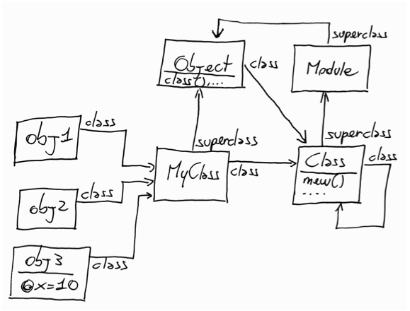

!SLIDE[tpl=power] center

# Великая мощь

!SLIDE incremental

.notes Теперь все хитрые вещи выражаются более унифицированно

# Просто вызов метода

 * создание нового объекта
 * создание нового класса

!SLIDE

	@@@ ruby
	class API
	  def register(klass1, klass2)
	    # здесь можно сделать
	    # какую-нибудь хитрую
	    # композицию из
	    # нескольких классов
	    @generator =
	      compose(klass1, klass2)
	  end

	  def generate_unit()
	    @generator.new
	  end
	end

!SLIDE

	@@@ ruby
	class API
	  def register_generator(klass)
	    @generator = Class.new(klass) do
	      def foobar
	        # some specific
	      end
	    end
	  end

	  def generate_unit()
	    @generator.new
	  end
	end

!SLIDE

.notes в некоторых языках также упрощаются следующие вещи

# Просто вызов метода

 * вызов метода
 * опеределение метода

!SLIDE

	@@@ ruby
	provider = 'gplus'
	s = AuthSession.new
	# вызов метода, это вызов метода!
	method = 'connect_via_' + provider
	s.send(method, 'foo@bar.com')

!SLIDE

	@@@ ruby
	fields_names = DataBase::Table
		.find('objects').fields()
	class Model
	  for name in fields_names
	    define_method(name) do
	      @record.get_attribute[name]
	    end
	  end
	end

!SLIDE

# Классы-объекты тоже принадлежат к классам

	@@@ ruby
	class Class
	  def foo()
	    puts "foo!"
	  end
	end

	class A; end

	A.foo()

!SLIDE center

!SLIDE

# И зачем нужна вся эта акробатика?

!SLIDE

# Великолепно для проектирования сложного API!