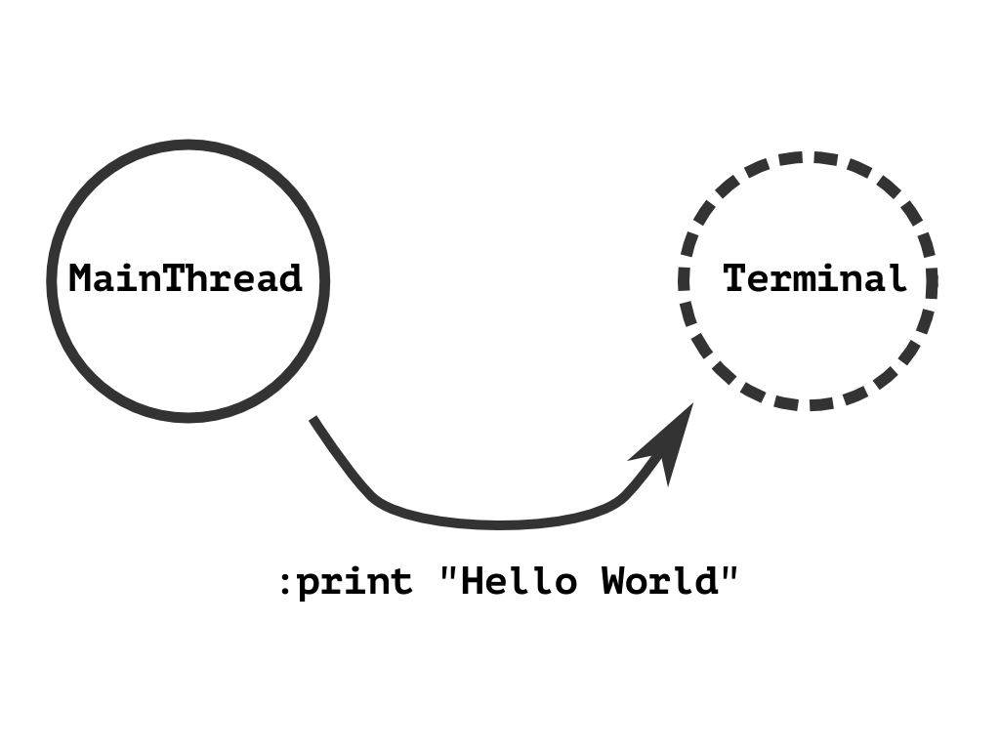

!SLIDE

# Нестандартная мантра

## Программа = Объекты + Cообщения

!SLIDE

# «Я придумал термин  „объектно‐ориентированный“,  и вот что я вам скажу,  я не имел ввиду С++»
## (ц) Алан Кей, автор языка Smalltalk

!SLIDE center

!SLIDE

# Нестандартная мантра

## Программа = Объекты + Cообщения

## —

!SLIDE

# Нестандартная мантра

## Программа = Объекты + Cообщения

## И ни слова про классы