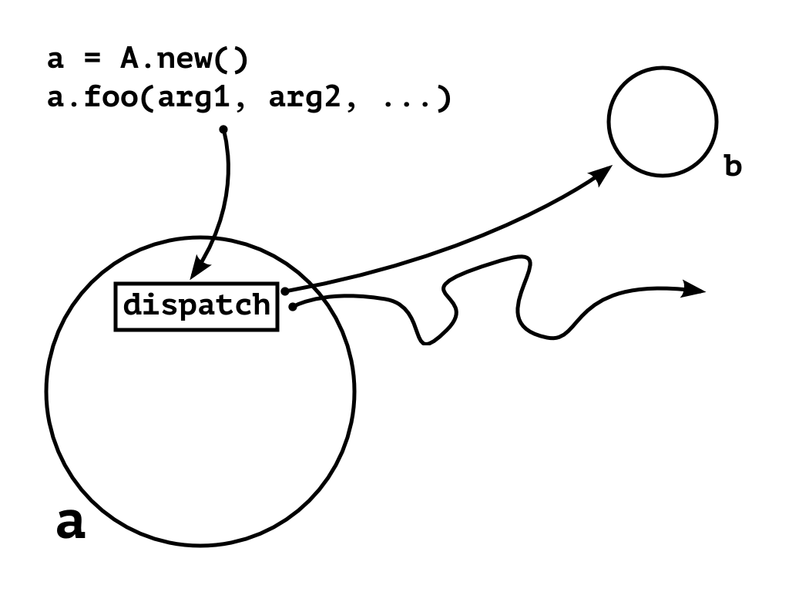
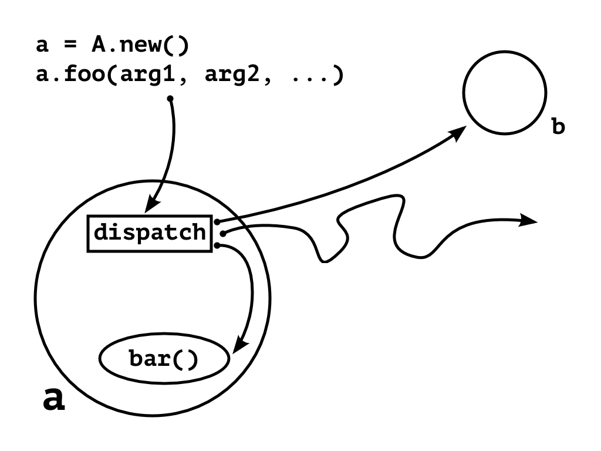

!SLIDE

# Посылка сообщения

!SLIDE center

!SLIDE center

!SLIDE center

!SLIDE center

!SLIDE center

!SLIDE

.notes Обыкновенные данные

# Сообщение

## имя метода и список аргументов

<code style="font-size:2em">
'foo', [arg1, arg2, ...]
</code>

!SLIDE

# Сообщение можно перенаправить или обработать каким-то особым образом

!SLIDE
.notes Пример приближённый к реальной практике

	@@@ ruby
	class AuthSession
	  def connect_via_google(email)
	    # ...
	  end

	  def method_missing(name, args)
	    case name.to_s
	    when /connect_via_(.+)/
	      # загрузить нужный код
	    else
	      super # обычное поведение
	    end
	  end
	end

!SLIDE
.notes Например можно динамически 
# Пример использования

	@@@ ruby
	s = AuthSession.new

	# предопределённый метод
	s.connect_via_google('foo@bar.ru')

	# хитрая обработка сообщения
	s.connect_via_vk('foo@bar.ru')

	# NoMethodError
	s.method_that_doesnt_match()
