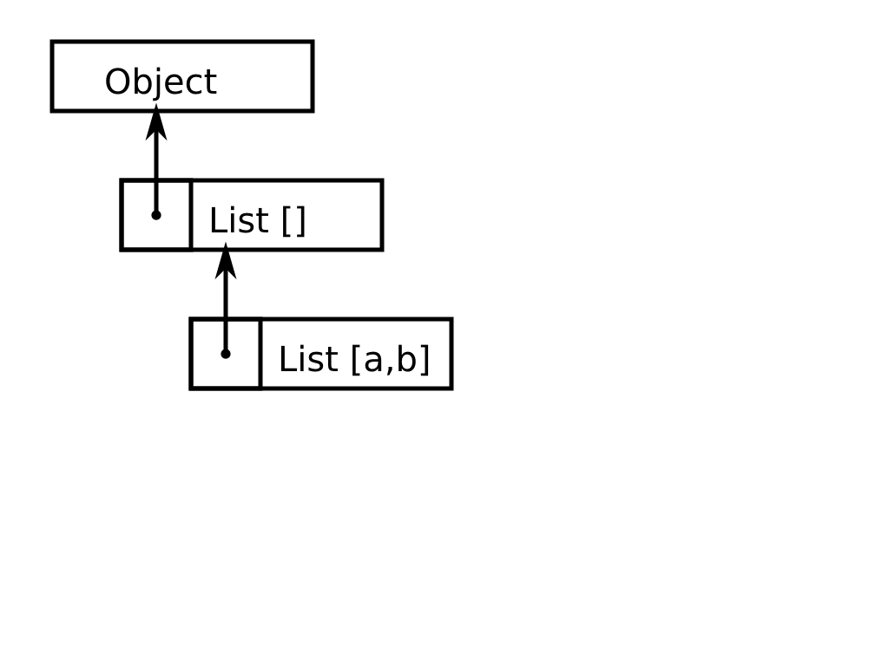
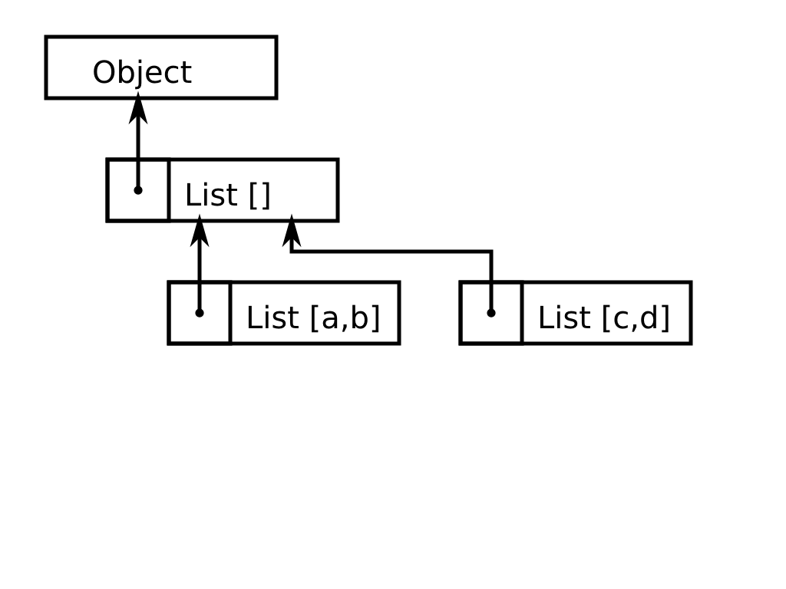

!SLIDE

.notes JavaScript создавали когда прототипное ООП входило в моду

# Клонирование вместо наследования

 * Io, Self, JavaScript (ограниченно)

!SLIDE center

!SLIDE center

!SLIDE

.notes матрицы -- векторы, классы -- объекты

# Упрощение классов-объектов

 * методы экземпляра
 * члены экземпляра
 * методы класса (так называемые static)
 * члены класса

!SLIDE

# Упрощение классов-объектов

 * методы экземпляра
 * члены экземпляра